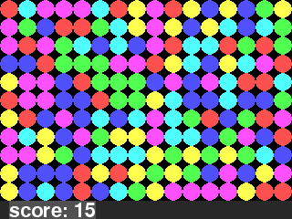

# Mapeli for a color match -game, written in hy.

Mapeli is a 'ghost of a game'. A new kind of holiday chore. Entertain yourself and give the mapeli a new life.

The mapeli always holds a theme, containing a shadow of a game whose name it bears.

In a well-written mapeli only thing that's needed to complete the mapeli is the reference manual of the programming language it's been written in.

Of course, you need pygame to run this mapeli because python&hy doesn't have a standard graphics library. Overall mapelies aren't supposed to hide any important details with third party libraries either. 

Mapelies rely on the fact that programming a game is often as fun as playing it. Do not complete them to publish and brag. Nevertheless a well-completed mapeli is capable of entertaining others. Be free to publish but keep in mind it is entirely optional for you to do so.
